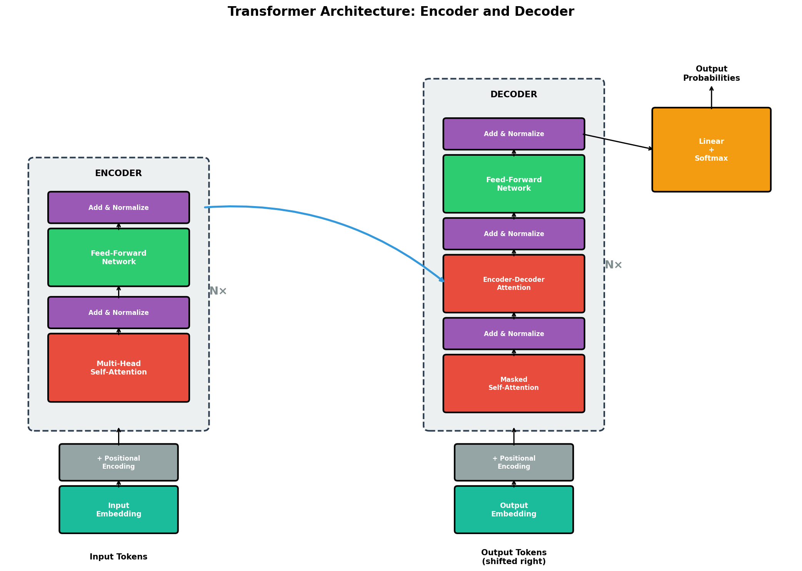

# Transformer Networks

## Introduction

In recent years, Transformers have revolutionized the field of deep learning — powering models such as BERT, GPT, and T5. Originally introduced in the 2017 paper "Attention Is All You Need" by Vaswani et al., Transformers replaced the need for recurrence and convolution with one powerful concept: **attention**.

Before Transformers, models like RNNs and LSTMs were dominant in processing sequences such as sentences. However, they struggled with long dependencies, parallelization, and training efficiency. Transformers solved these issues and became the foundation of modern natural language processing (NLP) and beyond — including vision, audio, protein modeling, and **cybersecurity applications**.

---

## The Core Idea: Attention

At the heart of the Transformer is the **attention mechanism** — a system that allows the model to "focus" on relevant parts of the input sequence when producing an output.

Imagine the sentence:

> *"The dog could not cross the wide road because **he** was tired."*

When we process the word "he", we must know that "he" refers to "dog". The model must **attend to "dog"** to understand the meaning correctly.

Traditional models like RNNs lose this information across long sequences. The attention mechanism solves this by connecting every word with every other word — **directly and efficiently**.

---

## Tokenization and Embedding

Before applying attention, the text must be converted into numbers.

1. Each word (or sub-word) is split into **tokens**:
   ```
   ["dog", "could", "not", "cross", "wide", "road", "because", "he", "was", "tired"]
   ```

2. Each token is mapped to a **high-dimensional vector** (e.g., 512 dimensions)

3. This **embedding** captures semantic meaning: words with similar meanings get closer in vector space

So now, instead of words, the Transformer processes a **matrix of embeddings** — one row per token.

---

## The Need for Order: Positional Encoding

Unlike RNNs, Transformers process all tokens **in parallel**. But this creates a problem: the model does not know which token comes first.

To fix this, Transformers add **positional encodings** — mathematical vectors that encode each token's position in the sequence:

```
dog → position 0
could → position 1
...
tired → position 9
```

These encodings are **added to the word embeddings** so that the model can distinguish "dog bit man" from "man bit dog".

### The Sinusoidal Positional Encoding (Vaswani et al., 2017)

The original Transformer uses a **deterministic, non-trainable function** for positional encoding:

$$
PE_{(pos, 2i)} = \sin\left(\frac{pos}{10000^{2i/d_{model}}}\right)
$$

$$
PE_{(pos, 2i+1)} = \cos\left(\frac{pos}{10000^{2i/d_{model}}}\right)
$$

Where:
- **pos** = position in the sequence (0, 1, 2, ...)
- **i** = dimension index
- **d_model** = embedding dimension (e.g., 512)

This means every position has a **unique wave pattern** across dimensions.


### Why Sine and Cosine?

1. **Bounded values**: All values are between -1 and 1 (stable training)
2. **Unique patterns**: Each position gets a unique encoding
3. **Relative positions**: PE(pos+k) can be represented as a linear function of PE(pos)
4. **Extrapolation**: Works for sequences longer than those seen during training
5. **No learning required**: Deterministic function, fewer parameters

---

## The Self-Attention Mechanism

The most powerful idea in the Transformer is **self-attention**. Each token produces three vectors:

- **Query (Q)** — What am I looking for?
- **Key (K)** — What do I contain?
- **Value (V)** — What information do I provide?

Each of them has the same dimension (e.g., **d_k = 64**).

### Computing Attention Scores

The attention score between two words is computed as:

$$
\text{Attention}(Q, K, V) = \text{softmax}\left(\frac{Q \cdot K^T}{\sqrt{d_k}}\right) \cdot V
$$

Where:
- **Q · K^T** computes similarity between query and all keys
- **√d_k** (e.g., √64 = 8) scales the result to prevent vanishing gradients
- **softmax** normalizes scores into attention weights (sum to 1)
- Multiply by **V** to get the weighted output

### Example

When the model looks at the word "**he**", the attention mechanism will give a **high score to "dog"** (the correct antecedent) and low scores to irrelevant words like "road".

This means that the representation of "he" now includes **contextual information about "dog"**.


---

## Multi-Head Attention

Instead of computing one attention pattern, Transformers use **multiple heads** (for example, 8 or 12).

Each head can focus on **different relationships**:
- One head might connect pronouns to nouns
- Another might focus on verb-object relations
- Another might attend to distant dependencies

The outputs from all heads are **concatenated and linearly transformed**:

$$
\text{MultiHead}(Q, K, V) = \text{Concat}(\text{head}_1, ..., \text{head}_h) \cdot W^O
$$

Where each head is:
$$
\text{head}_i = \text{Attention}(QW_i^Q, KW_i^K, VW_i^V)
$$

This enables the model to learn **diverse contextual patterns in parallel**.


---

## The Transformer Encoder

The **encoder** is the part of the Transformer that reads and understands the input. It consists of several stacked layers (usually **N = 6–12**).

Each layer has:
1. **Multi-Head Self-Attention**
2. **Add & Normalize** (residual connection + layer normalization)
3. **Feed-Forward Network** (same for every token)
4. **Add & Normalize**

The **residual connections** help stabilize training and allow the model to pass information more effectively, avoiding the vanishing gradient problem.

---

## The Decoder

The **decoder** is used when the Transformer needs to generate output (e.g., in translation or text generation).

It has:
- **Masked Self-Attention** (so it can't see future words)
- **Encoder–Decoder Attention** (to look at the input)
- **Feed-Forward Layers**

In translation, the decoder generates **one word at a time** while attending to both the input sentence and the previously generated words.



---

## Why Transformers Work So Well

| Advantage | Description |
|-----------|-------------|
| **Parallelization** | All tokens are processed simultaneously, using GPUs efficiently |
| **Long-Range Dependencies** | Any token can attend to any other, no matter how far apart |
| **Scalability** | Adding layers and parameters leads to better performance |
| **Generalization** | The same architecture works for text, images, speech, and more |

---

## Modern Transformer Models

| Model | Year | Main Idea |
|-------|------|-----------|
| **BERT** | 2018 | Bidirectional encoder for understanding context |
| **GPT** | 2018–2025 | Decoder-only model for text generation |
| **T5** | 2020 | Unified text-to-text framework |
| **Vision Transformer (ViT)** | 2021 | Applied Transformers to image patches |
| **ChatGPT / GPT-4** | 2023–2025 | Large-scale language models for dialogue |

---

## Applications in Cybersecurity

Transformers have emerged as powerful tools in cybersecurity due to their ability to process sequential data, understand context, and detect anomalous patterns.

### 1. Malware Detection and Classification

Transformers can analyze malware by treating executable code, API call sequences, or opcode sequences as "text":
- Convert binary code or API sequences into token sequences
- Use Transformer encoders to learn representations
- Classify as benign or malicious with malware family identification

**Advantage**: Captures long-range dependencies in code execution, more robust to obfuscation than signature-based methods.

### 2. Network Intrusion Detection

Network traffic can be represented as sequences of events for Transformer analysis:
- Analyzing NetFlow data sequences
- Processing system call sequences
- Monitoring authentication event streams

**Advantage**: Self-attention captures relationships between distant network events.

### 3. Phishing Detection

Pre-trained models like BERT excel at detecting phishing:
- Email content analysis for social engineering patterns
- URL structure analysis for suspicious characteristics
- Cross-lingual phishing detection

### 4. Log Analysis and Anomaly Detection

Security logs can be analyzed using Transformers (e.g., **LogBERT**):
- SIEM log analysis
- Authentication log monitoring
- System event correlation

### 5. Vulnerability Detection in Code

Transformers analyze source code to identify security vulnerabilities:
- SQL injection detection
- Buffer overflow identification
- Authentication bypass recognition

**Model example**: **CodeBERT** understands code semantics for static analysis.

### 6. Threat Intelligence Processing

NLP capabilities enable automated processing of threat intelligence:
- Named entity recognition for IOCs (Indicators of Compromise)
- Relationship extraction between threats and vulnerabilities
- Automated summarization of security reports

---

## Cybersecurity Transformer Models

| Model | Application |
|-------|-------------|
| **SecurityBERT** | Pre-trained on security corpora for malware detection |
| **CyBERT** | Domain-specific NLP for cyber threat intelligence |
| **CodeBERT** | Vulnerability detection through code understanding |
| **LogBERT** | Self-supervised log anomaly detection |
| **MalBERT** | Malware classification using Transformers |

---

## Conclusion

Transformers represent a paradigm shift in deep learning, with the **attention mechanism** enabling unprecedented capabilities in sequence modeling and pattern recognition. The key innovations — **self-attention for capturing relationships**, **positional encoding for sequence awareness**, and **multi-head attention for diverse patterns** — create a powerful architecture.

In cybersecurity, Transformers excel at understanding the context of security events, detecting anomalies in logs and network traffic, and identifying threats that traditional methods miss. As cyber threats become more sophisticated, Transformer-based models will play an increasingly critical role in defensive security.
