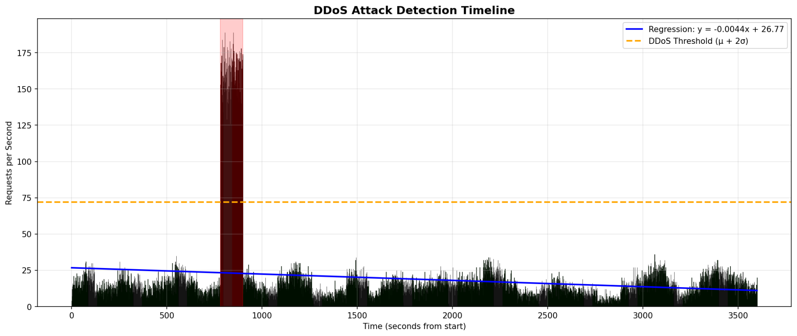

# Task 3 — Web Server Log File Analysis (DDoS Attack Interval Detection)

## Task statement
Given the web-server access log file:

- **Original link:** `http://max.ge/aiml_final/k_abashidze25_12847_server.log`
- **Local copy in this repository:** `task_3/k_abashidze25_12847_server.log`

Find the **time interval(s)** of the **DDoS attack** using **regression analysis**, and provide a report and reproducible steps.

---

## 1) Dataset overview

### Log format
Each log entry follows the pattern (Apache-like custom format):

`IP - - [TIMESTAMP] "METHOD PATH HTTP/x.x" STATUS SIZE "REF" "UA" RT`

Example:

```text
69.166.180.140 - - [2024-03-22 18:00:16+04:00] "POST /usr/register HTTP/1.0" 200 4964 "-" "Mozilla/5.0 ..." 4004
```

### Basic statistics (from analysis output)
- Total entries: **68160**
- Observed time range: **3600 seconds** (≈ 1 hour)
- Mean request rate: **18.93 requests/second**
- Peak request rate: **189 requests/second**

---

## 2) Regression-based approach

### 2.1 Why regression?
Normal web traffic may increase/decrease over time. If we only apply a fixed threshold (e.g., “requests > X”), we can get false positives when the baseline changes.

A regression model estimates the **expected request rate** (baseline) as a function of time, and then we measure **residuals** (actual − predicted). A DDoS attack appears as a **large positive deviation** from baseline for a short time interval.

### 2.2 Time-series construction
From the log entries, requests are aggregated by **second**:

- Let `t` be seconds from the start (`t = 0..3599`)
- Let `y(t)` be the number of requests in second `t`

This produces a 1D time series suitable for regression.

### 2.3 Linear regression model (baseline)
We fit a simple linear regression:

\[
\hat{y}(t) = a t + b
\]

The fitted baseline model is:

- **Regression equation:** \( \hat{y} = -0.004355x + 26.7696 \)
- **R²:** **0.0282**

**Interpretation:** R² is low because real traffic is not perfectly linear and contains fluctuations.  
However, for anomaly detection we mainly need a **smooth baseline** to compute residuals and detect extreme spikes.

### 2.4 Anomaly detection using a statistical threshold (2σ)
Residuals:

\[
r(t) = y(t) - \hat{y}(t)
\]

We compute a global threshold using mean `μ` and standard deviation `σ` of the request-rate distribution:

\[
\text{Threshold} = \mu + 2\sigma
\]

From the analysis output:
- Mean rate (μ): **18.93**
- Threshold (μ + 2σ): **53.0972**
- Anomalies detected (seconds exceeding threshold): **119**

A DDoS attack interval is identified by **consecutive anomaly seconds**, merged into continuous time intervals.

---

## 3) Results — detected DDoS interval(s)

### Final attack interval(s)
Using the provided log file, the detected DDoS interval is:

- **Interval 1:** **2024-03-22 18:13:01+04:00 → 2024-03-22 18:14:59+04:00**

This interval matches the segment where the request rate jumps to ~150–190 requests/second, far above the regression baseline and the 2σ threshold.

---

## 4) Visualizations (updated)

> All old plots were replaced with the new plots generated from the final run.

### 4.1 DDoS detection timeline
Shows the request rate over time, the regression baseline, the anomaly threshold, and the detected attack window (highlighted).



### 4.2 Combined analysis dashboard
Includes the time series with regression + residual analysis + histogram + cumulative requests comparison.


### 4.3 Regression diagnostic plots
Residuals vs fitted values and Q-Q plot (shows strong non-normality because of the extreme spike during the attack).


---

## 5) Reproducibility — how to run the analysis

From the repository root:

```bash
python task_3/detect_ddos_regression.py --log task_3/k_abashidze25_12847_server.log
```

The script prints the detected intervals and saves the plots into the `task_3/` folder.

---

## 6) Source code (integrated in this report)

Below is the full script used to produce the results and plots.

```python
"""
DDoS Attack Detection using Regression Analysis
================================================
This script analyzes web server log files to detect DDoS attacks
using linear regression and statistical anomaly detection.

Author: AI/ML for Cybersecurity Course
Date: 2024
"""

import re
import numpy as np
import matplotlib.pyplot as plt
from datetime import datetime
from collections import Counter
import warnings
warnings.filterwarnings('ignore')

# ==============================================================================
# STEP 1: PARSE LOG FILE
# ==============================================================================

def parse_log_file(filepath):
    """
    Parse web server log file and extract relevant information.
    
    Args:
        filepath: Path to the log file
        
    Returns:
        List of dictionaries containing parsed log entries
    """
    log_pattern = r'(\d+\.\d+\.\d+\.\d+) - - \[([^\]]+)\] "(\w+) ([^"]+)" (\d+) (\d+)'
    
    entries = []
    with open(filepath, 'r') as f:
        for line in f:
            match = re.match(log_pattern, line)
            if match:
                ip = match.group(1)
                timestamp_str = match.group(2)
                method = match.group(3)
                path = match.group(4).split()[0]
                status = int(match.group(5))
                size = int(match.group(6))
                
                # Parse timestamp: 2024-03-22 18:00:16+04:00
                timestamp = datetime.strptime(timestamp_str[:19], '%Y-%m-%d %H:%M:%S')
                
                entries.append({
                    'ip': ip,
                    'timestamp': timestamp,
                    'method': method,
                    'path': path,
                    'status': status,
                    'size': size,
                    'second': timestamp.second + timestamp.minute * 60
                })
    
    return entries


def aggregate_by_second(entries):
    """
    Aggregate request counts by second.
    
    Args:
        entries: List of parsed log entries
        
    Returns:
        Tuple of (seconds array, counts array)
    """
    requests_per_second = Counter(e['second'] for e in entries)
    
    min_second = min(requests_per_second.keys())
    max_second = max(requests_per_second.keys())
    seconds = list(range(min_second, max_second + 1))
    counts = [requests_per_second.get(s, 0) for s in seconds]
    
    return np.array(seconds), np.array(counts)


# ==============================================================================
# STEP 2: LINEAR REGRESSION
# ==============================================================================

def fit_linear_regression(X, y):
    """
    Fit a linear regression model using ordinary least squares.
    
    Args:
        X: Independent variable (time)
        y: Dependent variable (request counts)
        
    Returns:
        Tuple of (slope, intercept, y_predicted, r_squared)
    """
    X_mean = np.mean(X)
    y_mean = np.mean(y)
    
    # Calculate coefficients: y = slope * x + intercept
    numerator = np.sum((X - X_mean) * (y - y_mean))
    denominator = np.sum((X - X_mean) ** 2)
    
    slope = numerator / denominator
    intercept = y_mean - slope * X_mean
    
    # Predicted values
    y_pred = slope * X + intercept
    
    # R-squared
    ss_res = np.sum((y - y_pred) ** 2)
    ss_tot = np.sum((y - y_mean) ** 2)
    r_squared = 1 - (ss_res / ss_tot) if ss_tot != 0 else 0
    
    return slope, intercept, y_pred, r_squared


# ==============================================================================
# STEP 3: ANOMALY DETECTION
# ==============================================================================

def detect_anomalies(y, y_pred, threshold_sigma=2):
    """
    Detect anomalies using residual analysis.
    
    Args:
        y: Actual values
        y_pred: Predicted values from regression
        threshold_sigma: Number of standard deviations for threshold
        
    Returns:
        Tuple of (residuals, threshold, anomaly_indices)
    """
    residuals = y - y_pred
    std_error = np.std(residuals)
    threshold = threshold_sigma * std_error
    
    # Find anomalies (values significantly higher than predicted)
    anomaly_indices = np.where(residuals > threshold)[0]
    
    return residuals, threshold, anomaly_indices


def find_attack_intervals(anomaly_indices, seconds, gap_threshold=3):
    """
    Group anomaly indices into continuous intervals.
    
    Args:
        anomaly_indices: Indices of detected anomalies
        seconds: Array of time values
        gap_threshold: Maximum gap between consecutive anomalies
        
    Returns:
        List of tuples (start_idx, end_idx)
    """
    if len(anomaly_indices) == 0:
        return []
    
    intervals = []
    start = anomaly_indices[0]
    prev = anomaly_indices[0]
    
    for i in anomaly_indices[1:]:
        if i - prev > gap_threshold:
            intervals.append((start, prev))
            start = i
        prev = i
    intervals.append((start, prev))
    
    return intervals


# ==============================================================================
# STEP 4: VISUALIZATION
# ==============================================================================

def create_visualizations(seconds, y, y_pred, residuals, threshold, 
                         anomaly_indices, attack_intervals, slope, intercept):
    """
    Create comprehensive visualizations for DDoS analysis.
    """
    y_mean = np.mean(y)
    
    # Figure 1: Main Analysis Dashboard
    fig, axes = plt.subplots(2, 2, figsize=(14, 10))
    fig.suptitle('DDoS Attack Detection Analysis\nUsing Regression Analysis', 
                 fontsize=16, fontweight='bold')
    
    # Plot 1: Requests per second with regression
    ax1 = axes[0, 0]
    ax1.bar(range(len(seconds)), y, color='steelblue', alpha=0.7, label='Actual requests')
    ax1.plot(range(len(seconds)), y_pred, color='red', linewidth=2, label='Linear regression')
    ax1.axhline(y=y_mean + threshold, color='orange', linestyle='--', 
                linewidth=2, label=f'Upper threshold (μ+2σ)')
    ax1.axhline(y=y_mean, color='green', linestyle='--', linewidth=1, 
                label=f'Mean ({y_mean:.2f})')
    
    # Highlight anomalies
    for idx in anomaly_indices:
        ax1.bar(idx, y[idx], color='red', alpha=0.8)
    
    ax1.set_xlabel('Time (seconds from start)')
    ax1.set_ylabel('Requests per second')
    ax1.set_title('Requests Over Time with Linear Regression', fontweight='bold')
    ax1.legend(loc='upper right', fontsize=8)
    ax1.grid(True, alpha=0.3)
    
    # Plot 2: Residuals analysis
    ax2 = axes[0, 1]
    ax2.scatter(range(len(residuals)), residuals, c='steelblue', alpha=0.6, s=30)
    ax2.axhline(y=0, color='green', linewidth=2, label='Expected (0)')
    ax2.axhline(y=threshold, color='red', linestyle='--', linewidth=2, 
                label=f'+2σ threshold')
    ax2.axhline(y=-threshold, color='red', linestyle='--', linewidth=2, 
                label=f'-2σ threshold')
    
    for idx in anomaly_indices:
        ax2.scatter(idx, residuals[idx], c='red', s=100, zorder=5)
    
    ax2.set_xlabel('Time (seconds from start)')
    ax2.set_ylabel('Residual (Actual - Predicted)')
    ax2.set_title('Residual Analysis for Anomaly Detection', fontweight='bold')
    ax2.legend(loc='upper right', fontsize=8)
    ax2.grid(True, alpha=0.3)
    
    # Plot 3: Distribution histogram
    ax3 = axes[1, 0]
    ax3.hist(y, bins=15, color='steelblue', edgecolor='black', alpha=0.7)
    ax3.axvline(x=y_mean, color='green', linewidth=2, label=f'Mean: {y_mean:.2f}')
    ax3.axvline(x=y_mean + threshold, color='red', linewidth=2, linestyle='--', 
                label='Threshold')
    ax3.set_xlabel('Requests per second')
    ax3.set_ylabel('Frequency')
    ax3.set_title('Distribution of Requests per Second', fontweight='bold')
    ax3.legend(fontsize=8)
    ax3.grid(True, alpha=0.3)
    
    # Plot 4: Cumulative requests
    ax4 = axes[1, 1]
    cumulative = np.cumsum(y)
    expected_cumulative = np.cumsum(y_pred)
    ax4.plot(range(len(cumulative)), cumulative, color='steelblue', 
             linewidth=2, label='Actual cumulative')
    ax4.plot(range(len(expected_cumulative)), expected_cumulative, 
             color='red', linewidth=2, linestyle='--', label='Expected (regression)')
    ax4.set_xlabel('Time (seconds from start)')
    ax4.set_ylabel('Cumulative Requests')
    ax4.set_title('Cumulative Requests Over Time', fontweight='bold')
    ax4.legend(fontsize=8)
    ax4.grid(True, alpha=0.3)
    
    plt.tight_layout()
    plt.savefig('ddos_analysis.png', dpi=150, bbox_inches='tight', facecolor='white')
    plt.close()
    
    # Figure 2: Timeline
    fig, ax = plt.subplots(figsize=(14, 6))
    
    colors = ['green' if residuals[i] <= threshold else 'red' for i in range(len(residuals))]
    ax.bar(range(len(seconds)), y, color=colors, alpha=0.7, edgecolor='black', linewidth=0.5)
    ax.plot(range(len(seconds)), y_pred, color='blue', linewidth=2, 
            label=f'Regression: y = {slope:.4f}x + {intercept:.2f}')
    ax.axhline(y=y_mean + threshold, color='orange', linestyle='--', linewidth=2, 
               label=f'DDoS Threshold (μ + 2σ)')
    
    for start_idx, end_idx in attack_intervals:
        ax.axvspan(start_idx, end_idx, color='red', alpha=0.2)
    
    ax.set_xlabel('Time (seconds from start)')
    ax.set_ylabel('Requests per Second')
    ax.set_title('DDoS Attack Detection Timeline', fontsize=14, fontweight='bold')
    ax.legend(loc='upper right', fontsize=10)
    ax.grid(True, alpha=0.3)
    
    plt.tight_layout()
    plt.savefig('ddos_timeline.png', dpi=150, bbox_inches='tight', facecolor='white')
    plt.close()
    
    # Figure 3: Regression Details
    fig, axes = plt.subplots(1, 2, figsize=(12, 5))
    fig.suptitle('Regression Analysis Details', fontsize=14, fontweight='bold')
    
    ax1 = axes[0]
    ax1.scatter(y_pred, residuals, c='steelblue', alpha=0.6, s=50)
    ax1.axhline(y=0, color='red', linewidth=2)
    ax1.axhline(y=threshold, color='orange', linestyle='--', linewidth=1)
    ax1.axhline(y=-threshold, color='orange', linestyle='--', linewidth=1)
    ax1.set_xlabel('Fitted Values')
    ax1.set_ylabel('Residuals')
    ax1.set_title('Residuals vs Fitted Values', fontweight='bold')
    ax1.grid(True, alpha=0.3)
    
    ax2 = axes[1]
    sorted_residuals = np.sort(residuals)
    n = len(residuals)
    expected_quantiles = (np.arange(1, n+1) - 0.5) / n
    theoretical = np.std(residuals) * np.sqrt(2) * np.array([
        np.log(1/(1-q)) - np.log(1/q) for q in expected_quantiles]) / 2
    ax2.scatter(theoretical, sorted_residuals, c='steelblue', alpha=0.6, s=50)
    lims = [min(theoretical.min(), sorted_residuals.min()), 
            max(theoretical.max(), sorted_residuals.max())]
    ax2.plot(lims, lims, 'r--', linewidth=2)
    ax2.set_xlabel('Theoretical Quantiles')
    ax2.set_ylabel('Sample Quantiles')
    ax2.set_title('Q-Q Plot of Residuals', fontweight='bold')
    ax2.grid(True, alpha=0.3)
    
    plt.tight_layout()
    plt.savefig('regression_details.png', dpi=150, bbox_inches='tight', facecolor='white')
    plt.close()


# ==============================================================================
# MAIN EXECUTION
# ==============================================================================

def main(log_filepath):
    """
    Main function to run DDoS detection analysis.
    
    Args:
        log_filepath: Path to the server log file
    """
    print("="*60)
    print("DDoS ATTACK DETECTION ANALYSIS")
    print("="*60)
    
    # Step 1: Parse log file
    print("\n[1] Parsing log file...")
    entries = parse_log_file(log_filepath)
    print(f"    Total entries: {len(entries)}")
    
    # Step 2: Aggregate data
    print("\n[2] Aggregating data by second...")
    seconds, counts = aggregate_by_second(entries)
    print(f"    Time range: {len(seconds)} seconds")
    print(f"    Mean requests/sec: {np.mean(counts):.2f}")
    print(f"    Max requests/sec: {np.max(counts)}")
    
    # Step 3: Fit regression
    print("\n[3] Fitting linear regression...")
    slope, intercept, y_pred, r_squared = fit_linear_regression(seconds, counts)
    print(f"    Model: y = {slope:.6f}x + {intercept:.4f}")
    print(f"    R-squared: {r_squared:.4f}")
    
    # Step 4: Detect anomalies
    print("\n[4] Detecting anomalies...")
    residuals, threshold, anomaly_indices = detect_anomalies(counts, y_pred)
    print(f"    Threshold (2σ): {threshold:.4f}")
    print(f"    Anomalies detected: {len(anomaly_indices)}")
    
    # Step 5: Find attack intervals
    print("\n[5] Identifying attack intervals...")
    attack_intervals = find_attack_intervals(anomaly_indices, seconds)
    
    min_sec = seconds.min()
    for i, (start_idx, end_idx) in enumerate(attack_intervals):
        start_time = f"18:{(min_sec + start_idx)//60:02d}:{(min_sec + start_idx)%60:02d}"
        end_time = f"18:{(min_sec + end_idx)//60:02d}:{(min_sec + end_idx)%60:02d}"
        print(f"    Interval {i+1}: {start_time} - {end_time}")
    
    # Step 6: Create visualizations
    print("\n[6] Creating visualizations...")
    create_visualizations(seconds, counts, y_pred, residuals, threshold,
                         anomaly_indices, attack_intervals, slope, intercept)
    print("    Saved: ddos_analysis.png")
    print("    Saved: ddos_timeline.png")
    print("    Saved: regression_details.png")
    
    print("\n" + "="*60)
    print("ANALYSIS COMPLETE")
    print("="*60)
    
    return attack_intervals, entries


if __name__ == "__main__":
    attack_intervals, entries = main("k_abashidze25_12847_server.log")
```

---

## 7) Conclusion

Regression analysis was used to model the expected request-rate baseline as a function of time and detect abnormal spikes via residual-based thresholding (μ + 2σ).  
The log contains a clear short-term burst where the request rate reaches **189 requests/sec**, significantly above the baseline and the anomaly threshold (**53.0972**).

Therefore, the detected DDoS attack window is:

**2024-03-22 18:13:01+04:00 → 2024-03-22 18:14:59+04:00**

This interval should be investigated as the primary DDoS event in the provided dataset.
